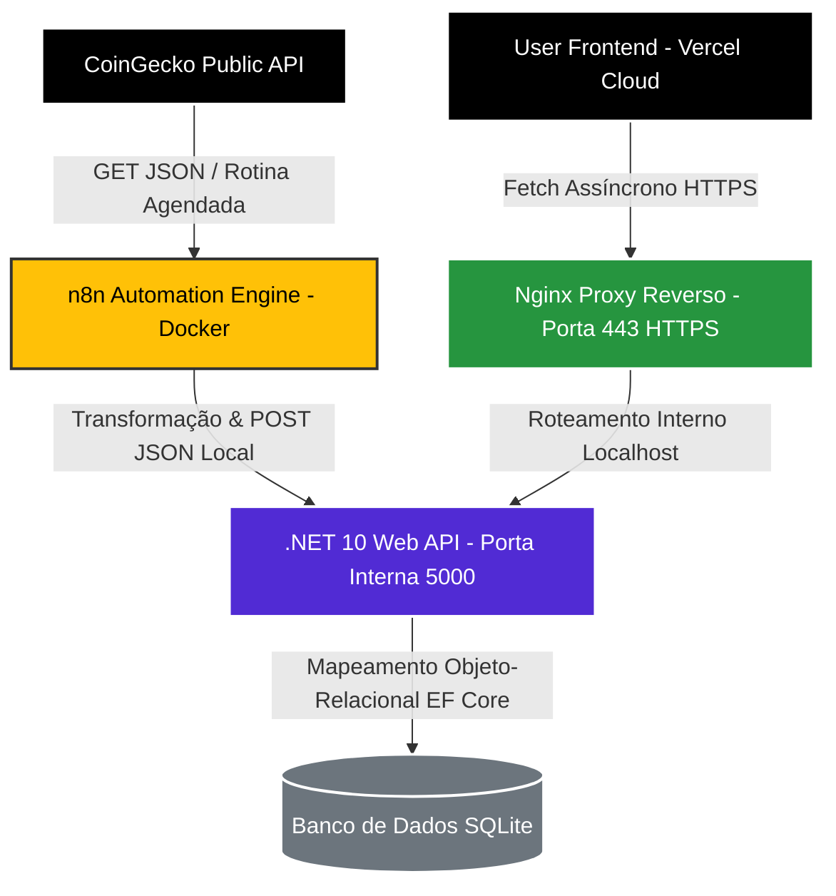

# Crypto Monitor - Ecossistema Full-Stack Autônomo de Monitoramento

Um ecossistema full-stack resiliente, autônomo e de alta disponibilidade (24/7), projetado para capturar, processar, persistir e renderizar dados analíticos de criptoativos em tempo real. O sistema integra engenharia de dados distribuída, microsserviços conteinerizados, uma API robusta fundamentada em práticas de arquitetura limpa e um frontend desacoplado.

---

## 🔗 Link do Projeto

- **Projeto ativo 24/7:** [https://crypto-monitor-fullstack.vercel.app/](https://crypto-monitor-fullstack.vercel.app/)

---

## 🏛️ Fluxograma da Arquitetura e Engenharia de Dados

O projeto opera de forma totalmente desacoplada para garantir escalabilidade, segurança e isolamento de falhas, seguindo o fluxo mapeado abaixo:

### Fluxo de Dados Detalhado

1. **Ingestão:** O motor de automação (n8n) consome APIs externas de finanças através de gatilhos cronometrados (Schedule Triggers).
2. **Processamento Inicial:** O n8n trata o payload bruto (data parsing e higienização) e dispara os dados consolidados localmente para a API .NET 10.
3. **Roteamento e Segurança:** O Nginx atua como Proxy Reverso na borda do servidor, interceptando requisições públicas de leitura via HTTPS, validando o certificado SSL e distribuindo o tráfego.
4. **Persistência:** A API processa as requisições aplicando regras de negócio e persiste as métricas no banco de dados relacional através do Entity Framework Core.
5. **Consumo:** A aplicação cliente hospedada na Vercel consome de forma assíncrona os endpoints seguros da API para renderizar os dados atualizados ao usuário final.

---

## 🛠️ Engenharia de Software: Padrões de Projeto Aplicados

O backend da aplicação foi desenvolvido utilizando os mais rígidos padrões arquiteturais de mercado, focando em manutenibilidade, testabilidade e extensibilidade.

### Domain-Driven Design (DDD)

A estrutura de pastas e a separação de conceitos lógica isola a complexidade de negócio das dependências de infraestrutura tecnológica:

| Camada             | Responsabilidade                                                                                                                                                 |
| ------------------ | ---------------------------------------------------------------------------------------------------------------------------------------------------------------- |
| **Domain**         | Núcleo normativo do projeto. Contém entidades de negócio, contratos (interfaces) e regras fundamentais, totalmente livre de acoplamento com frameworks externos. |
| **Application**    | Camada de transição responsável por orquestrar os casos de uso, mediando o fluxo de dados entre os pontos de entrada e o domínio.                                |
| **Infrastructure** | Gerencia preocupações técnicas transversais: contexto de persistência (EF Core, Migrations) e integrações de baixo nível.                                        |
| **API**            | Camada de exposição dos endpoints REST, responsável pelo ciclo de vida das requisições HTTP, filtros de rota e respostas JSON.                                   |

### Princípios SOLID

- **Single Responsibility Principle (SRP):** Componentes, serviços e controladores desacoplados, garantindo que cada classe possua uma única e bem definida responsabilidade dentro do fluxo de execução.
- **Dependency Inversion Principle (DIP):** Arquitetura baseada em contratos. Os controladores e serviços dependem estritamente de abstrações (interfaces), injetadas nativamente pelo container de IoC do .NET, eliminando o acoplamento rígido entre implementações.

---

## 📦 Detalhes Técnicos dos Componentes Implementados

### 1. Automação e Pipelines de Ingestão (n8n)

- **Tecnologia:** n8n Workflow Engine operando via Docker na VM.
- **Papel no Ecossistema:** Executa o pipeline de ETL (Extract, Transform, Load). Manipula os payloads financeiros externos e repassa a estrutura limpa de dados diretamente para a API.
- **Componente de Código:** A topologia visual e a lógica declarativa de nós do robô estão armazenadas no arquivo `workflow.json` na raiz deste repositório, garantindo a reprodutibilidade integral do microsserviço de automação.

### 2. Hospedagem e Nuvem (Oracle Cloud VPS)

- **Tecnologia:** VM Compute Instance (Ubuntu Server LTS).
- **Papel no Ecossistema:** Computação central responsável por hospedar e manter todo o ecossistema backend e microsserviços operando 24/7.
- **Otimização de Memória Virtual (SWAP):** Para mitigar limitações de hardware físico e prevenir falhas de concorrência ou quedas em sessões SSH por falta de memória (OOM), configurou-se uma partição de paginação virtual de 2GB (SWAP) direto em disco, garantindo estabilidade operacional contínua ao kernel do Linux.

### 3. Conteinerização (Docker)

- **Tecnologia:** Docker & Docker Compose.
- **Papel no Ecossistema:** Fornece o isolamento do microsserviço n8n. Para maximizar o desempenho e eliminar a latência de rede externa na ingestão, o container realiza a comunicação interna direcionada ao gateway padrão do ambiente virtual do Docker, mantendo o tráfego de gravação estritamente local.

### 4. Servidor Web e Proxy Reverso (Nginx)

- **Tecnologia:** Nginx Edge Web Server.
- **Papel no Ecossistema:** Concentra o tráfego público de entrada nas portas padrão (80 / 443). O servidor processa o proxy reverso direcionando as requisições do subdomínio público diretamente para a porta local interna `5000` onde reside o Kestrel da API .NET.

### 5. Ciclo de Vida do Sistema (Systemd Services)

- **Tecnologia:** Linux Systemd Unit Files.
- **Papel no Ecossistema:** A API backend foi encapsulada como um daemon do sistema operacional (`monitor-api.service`). Isso fornece tolerância a falhas nativa: se ocorrer um erro inesperado em tempo de execução ou o servidor web passar por uma reinicialização programada, o sistema gerencia a recuperação e reergue o serviço automaticamente.

### 6. Camada de Criptografia TLS (Certbot Let's Encrypt)

- **Tecnologia:** TLS/SSL Automatizado via Certbot.
- **Papel no Ecossistema:** Injeta criptografia assimétrica de ponta a ponta na rede. A emissão e renovação automática de chaves públicas sanaram vulnerabilidades de segurança e solucionaram bloqueios por Mixed Content durante as requisições de origem do cliente.

### 7. Banco de Dados e Persistência (EF Core & SQLite)

- **Tecnologia:** Entity Framework Core (Abordagem Code-First) + SQLite.
- **Papel no Ecossistema:** Motor de armazenamento leve e de alta performance para cenários embarcados. O esquema relacional é evoluído incrementalmente de forma limpa através de comandos controlados de Migrations, mapeando diretamente objetos de código em registros relacionais estáveis.

### 8. Frontend Distribuído (Vercel)

- **Tecnologia:** HTML5 / Vanilla CSS / JavaScript Assíncrono (Fetch API / CORS Ativo).
- **Papel no Ecossistema:** Camada de apresentação reativa, otimizada para carregamento veloz. Hospedado na rede global de CDNs da Vercel, o cliente consome assincronamente a API sem travar a interface do usuário.

---

## 🚀 Esteira Cronológica do Deploy

O sucesso na estabilização e sustentabilidade da infraestrutura seguiu esta ordem estrita de execução:

1. **Provisionamento da VPS e Otimização:** Criação da instância Ubuntu, alocação estratégica de 2GB de memória SWAP e fechamento de portas vulneráveis utilizando `ufw`, expondo apenas as portas web públicas de produção.
2. **Isolamento de Containers:** Implantação e orquestração do container do n8n via Docker para recebimento estável do pipeline de automação.
3. **Zoneamento de DNS de Domínio:** Apontamento de registros do tipo `A` e `CNAME` ligando os subdomínios da aplicação aos IPs públicos reais da máquina em nuvem.
4. **Configuração de Proxy Reverso:** Parametrização dos arquivos de configuração do Nginx para encaminhamento do tráfego público para as respectivas portas internas locais.
5. **Automação de Background (Systemd):** Configuração do arquivo `.service` para delegar o ciclo de vida da API .NET ao gerenciador de processos nativo do Linux.
6. **Segurança de Borda com HTTPS:** Execução das rotinas do Certbot para atrelar certificados SSL válidos aos subdomínios e ativação automática do `cron` de renovação das chaves.
7. **Deploy Frontend:** Publicação contínua da aplicação na Vercel, ajustando os parâmetros de requisição assíncrona para apontar para o domínio oficial seguro da API.

---

## 📌 Ferramentas Complementares de Desenvolvimento

> **ngrok para Ambiente de Debugging:** Durante fases preliminares ou cenários de testes locais isolados (onde não há um domínio de internet registrado ou IP público disponível), o ngrok foi utilizado de maneira pontual para expor temporariamente as portas locais através de túneis públicos seguros. Em ambiente produtivo estabilizado, o serviço do ngrok foi desativado do ecossistema e removido da inicialização de boot do sistema operacional, delegando toda a responsabilidade de rede de forma nativa e profissional ao Nginx.
